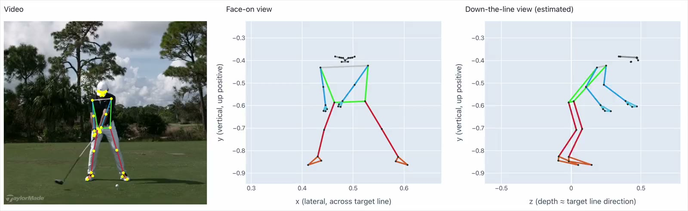
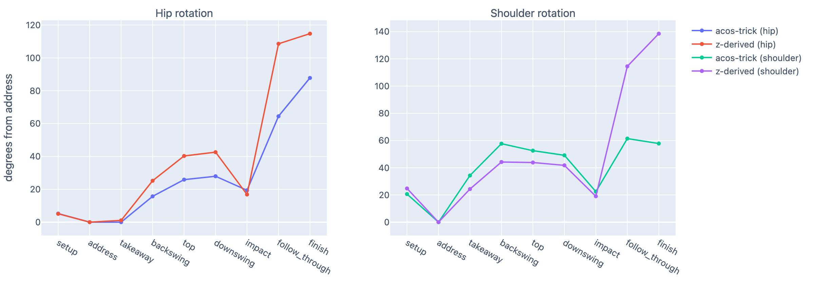
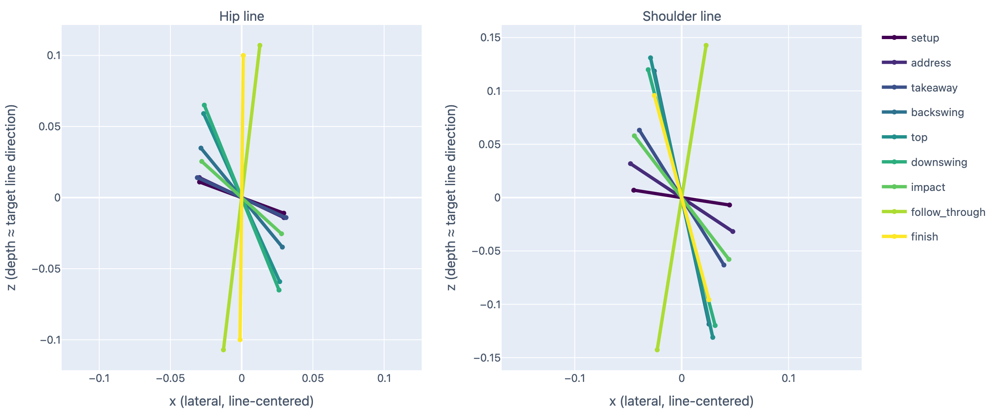
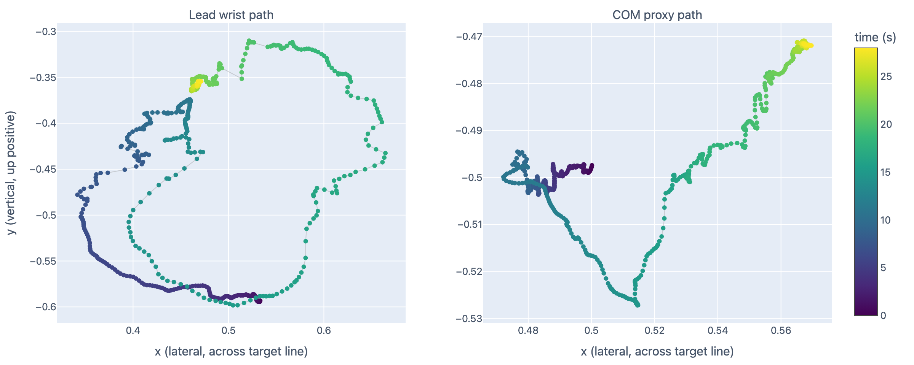

# SwingLens

Extracts a per-frame physical state trajectory from a single-camera golf swing video using MediaPipe pose estimation.

[](assets/face_on_scrubber.mp4)

## Features

- Pose detection (33 MediaPipe landmarks) with Savitzky-Golay smoothing
- Swing phase detection from setup to finish
- Hip and shoulder rotation from two independent estimators (projected span and MediaPipe depth)
- `SwingState` trajectory export to JSON or CSV
- Interactive HTML report with synced video and skeleton scrubber
- Swing issue detection per club, swing type and camera angle

## Requirements

- Python 3.14
- [uv](https://docs.astral.sh/uv/)

The MediaPipe pose model downloads to `models/` on first run.

## Installation

```bash
git clone git@github.com:alexschedrov/swinglens.git
cd swinglens
uv sync
```

## Usage

```bash
uv run python cli.py <command> [options]
```

| Command | Output |
|---|---|
| `annotate` | Skeleton-overlay video with phase labels |
| `export` | `SwingState` trajectory (`.json` or `.csv`) |
| `report` | Self-contained interactive HTML report |
| `charts` | Plotly JSON file per chart |

| Option | Values |
|---|---|
| `--face-on`, `--dtl`, `--video` | Input video. `--video` leaves the camera angle unknown |
| `--club` | `driver`, `wood`, `hybrid`, `iron` (default), `short_iron`, `wedge` |
| `--swing-type` | `full` (default), `partial`, `pitch`, `chip` |
| `--output` | Output path (directory for `charts`) |

`annotate` takes `--video` only.

### Examples

```bash
uv run python cli.py report --face-on swing.mp4 --club driver --output report.html
uv run python cli.py export --dtl swing.mp4 --output state_trajectory.json
uv run python cli.py annotate --video swing.mp4 --output annotated.mp4
uv run python cli.py charts --face-on swing.mp4 --output charts/
```

## Output

Each frame produces one `SwingState`:

| Field | Description |
|---|---|
| `frame_idx`, `timestamp` | Frame index and time in seconds |
| `phase` | Swing phase label |
| `pelvis_rotation`, `torso_rotation` | Degrees from address |
| `lead_arm_angle` | Degrees at the lead elbow |
| `wrist_position`, `head_position` | Normalized x, y, z |
| `com_proxy` | Weighted blend of hips, shoulders and head |
| `angular_velocities` | Pelvis, torso and lead arm, degrees per second |

## Sample results

Face-on driver swing ([source](https://www.youtube.com/watch?v=P3YksJdejog)).

**Rotation per phase, both estimators**



**Hip and shoulder lines, top-down view**



**Lead wrist and COM proxy paths**



## Project structure

```
cli.py           CLI entry point
config.py        Ideal ranges and settings
pose/            Landmark detection and smoothing
swing/           Phases, metrics, rotation, SwingState
analysis/        Issue detection
report/          Export, HTML report, charts
visualization/   Annotated video
templates/       HTML report templates
```

## Limitations

- Rotation estimates are not validated against motion capture.
- The span estimator works only with face-on video and saturates at 90°.
- Movement toward or away from the camera and shoulder tilt inflate span-based rotation.
- MediaPipe depth (`z`) is a model estimate, not a measurement.
- `com_proxy` is not a true center of mass.

## Utilities

Download a clip section and split a side-by-side video into two angles:

```bash
brew install yt-dlp ffmpeg

yt-dlp -f "bv*[height<=720]+ba/b[height<=720]" --merge-output-format mp4 \
  --download-sections "*00:01:30-00:02:00" --force-keyframes-at-cuts \
  -o "downloaded.%(ext)s" "<youtube-url>"

ffmpeg -i downloaded.mp4 -filter:v "crop=iw*0.6:ih:0:0" -c:a copy left.mp4
ffmpeg -i downloaded.mp4 -filter:v "crop=iw*0.4:ih:iw*0.6:0" -c:a copy right.mp4
```

## Sources

- [MediaPipe Pose Landmarker](https://ai.google.dev/edge/mediapipe/solutions/vision/pose_landmarker)
- Sample footage: [Rory McIlroy's Powerful Driver Swing](https://www.youtube.com/watch?v=P3YksJdejog) by TaylorMade Golf

## License

[MIT](LICENSE)
